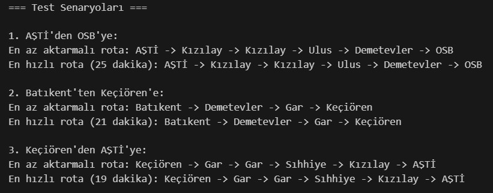

# 🚇 Metro Rota Simülasyon Projesi

## Proje Tanımı
Bu proje, **Akbank & Global AI Hub Python ile Yapay Zekaya Giriş Bootcamp'i** kapsamında geliştirilmiştir. Projemizin temel amacı, metro ağı üzerinde iki farklı algoritma (BFS ve A*) kullanarak **minimum aktarmalı** ve **en hızlı** güzergahları belirlemektir.

## 🛠️ Kullanılan Teknolojiler

| Kütüphane | Açıklama |
|-----------|----------|
| `collections` | BFS algoritması için kuyruk (deque) veri yapısı |
| `heapq` | A* algoritmasında öncelikli kuyruk oluşturmak için |
| `typing` | Kod okunabilirliğini artıran tür ipuçları |

## 🧠 Algoritma Yaklaşımları

### 🔄 BFS (Genişlik Öncelikli Arama)
- **Amacı**: İstasyonlar arasında en az aktarmalı rotaları bulmak
- **Çalışma Prensibi**: 
  - Kuyruk yapısı kullanarak tüm olası rotaları tarama
  - Her adımda komşu istasyonları keşfetme
- **Tercih Sebebi**: Minimum aktarma sayısına göre en uygun yolu bulma

### ⚡ A* Algoritması
- **Amacı**: İstasyonlar arasında en hızlı rotaları hesaplamak
- **Çalışma Prensibi**:
  - Öncelikli kuyruk ile rota optimizasyonu
  - Her adımda toplam seyahat süresini hesaplama
- **Özellikleri**: Basitleştirilmiş heuristic yaklaşımı

## 🧪 Örnek Rota Senaryoları

### Senaryo 1: AŞTİ → OSB
- **Az Aktarmalı Rota**: AŞTİ → Kızılay → Ulus → Demetevler → OSB
- **En Hızlı Rota**: Toplam 19 dakika

### Senaryo 2: Batıkent → Keçiören
- **Az Aktarmalı Rota**: Batıkent → Demetevler → Gar → Keçiören
- **En Hızlı Rota**: Toplam 21 dakika

### Senaryo 3: Keçiören → AŞTİ
- **Az Aktarmalı Rota**: Keçiören → Gar → Sıhhiye → Kızılay → AŞTİ
- **En Hızlı Rota**: Toplam 14 dakika



## 💡 Gelecek Geliştirmeler
- Gerçek zamanlı veri entegrasyonu
- Harita tabanlı görsel arayüz
- Dinamik hat yönetim sistemi
- Aktarma noktalarının görselleştirilmesi
- Gelişmiş rota hesaplama algoritmaları

## 🚀 Projeyi Çalıştırma
```bash
python ŞeymaCoştur_MetroSimulation.py
```

## 🔍 Notlar
- Türkçe karakter desteği için `utf-8` kodlaması kullanılmıştır
- Çıktılar terminal üzerinde doğru görüntülenecek şekilde yapılandırılmıştır
